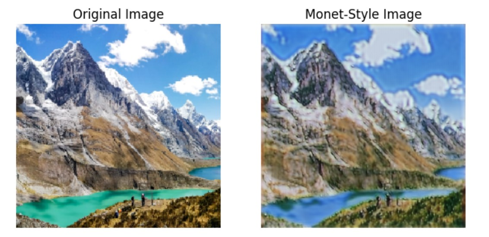

# CycleGAN-Photo-to-Monet-Painting

## Introduction
This project employs a CycleGAN-based deep learning model to transform photos into Monet-style paintings. It showcases custom architecture and extensive experimentation in Python with TensorFlow Keras. The model was developed as part of the "I’m Something of a Painter Myself" competition on the Kaggle website, achieving a MiFID score of 67.

For more information about the competition and to access the dataset, visit the [Kaggle competition page](https://www.kaggle.com/competitions/gan-getting-started/overview).

### What is CycleGAN?
CycleGAN is a type of Generative Adversarial Network (GAN) designed for unpaired image-to-image translation. Unlike traditional methods that require paired examples of images in different styles for training, CycleGAN learns to translate images between two domains without any direct correspondences.

### Photo to Monet Style Transfer
The task of transforming photographs into Monet-style paintings is an example of unpaired image-to-image translation. In this case, we aim to convert everyday photographs into images that capture the distinct visual characteristics of Monet's paintings, such as vibrant colors, textured brushstrokes, and dreamy atmospheres.

CycleGAN achieves this transformation by simultaneously training two generators and two discriminators. The generators learn to translate images from one domain (photographs) to another (Monet-style paintings), while the discriminators distinguish between real and generated images. Through adversarial training and cycle-consistency loss, CycleGAN ensures that the translated images not only resemble the target style but also preserve the content of the original photographs.

### Dataset Distribution
* 7038 regular images in JPG format
* 300 Monet paintings in JPG format
  
## Data Preparation
- The Kaggle API was utilized to download the dataset efficiently.
- A split action took place in cases where the model was trained with fewer than 300 images for each domain.
- All images were scaled to a pixel range of [-1, 1].
- All images were resized to a size of 320x320.
- A normalization operation was performed.
  
**Note:** It's important to highlight that the images processed by this model are sized at 320 x 320 pixels, differing from the more common 256 x 256 pixel size. Additionally, the discriminator's receptive field size is intentionally set to differ from the standard 70 x 70. These modifications were implemented to elevate the project's complexity and to discourage the direct application of existing online projects.

## Improvements Process
The training notebook consists all explanations and conclusions about how the best result was achieved.

## How to Use
In the project's files, you can find:
1. **Google Colab Notebooks** (inside the `notebooks` folder):
    - **ADL_Test_Notebook.ipynb**: 
      - This notebook allows you to provide an image as input and get a Monet-style output.
      - **How to Run**:
          - Open the notebook in Google Colab, follow the instructions in the notebook, and run the cells sequentially. 
            Upload your original image when prompted.
      
    - **ADL_Training_Notebook.ipynb**:
      - This notebook contains details about the training process, including data preprocessing, model architecture, training different approaches that were tested.
      - **How to Set Up the Dataset for Training**:
         - Open and save a copy of the Google Colab notebooks in your Google Drive.
         - Open a Kaggle account and create an API token for fetching the dataset (or download the data to your local device and change the code accordingly).
         - Check all paths within the code and make them suitable for your personal use.
         - Modify and train the models as you please.

2. **Python Scripts** (inside the `scripts` folder):
   - **ADL_Test_Script.py**
   - **ADL_Training_Script.py**
   These files are in Python format for your convenience.  

## Trained Models
The trained models used for this project are also included in the repository. You can use these models directly without retraining.

## License
This project is licensed under the MIT License. You are free to use, modify, and distribute this project, as long as the original license and attribution are retained. For more details, see the [LICENSE](LICENSE) file.

## Contributing
Feel free to contribute by opening issues or creating pull requests.

## Author
This project was created and is maintained by [RoDanielle](https://github.com/RoDanielle).  
For questions, feel free to reach out via GitHub.
